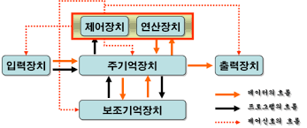

## 컴퓨터의 구성

* 컴퓨터 시스템은 크게 2가지로 나누어짐

  * 하드웨어 : 컴퓨터를 구성하는 기계적 장치

    * 중앙처리장치(CPU)

    * 기억장치: RAM, HDD

    * 입출력 장치: 마우스, 프린터

  * 소프트웨어: 하트웨어의 동작을 지시하고 제어하는 명령어 집합
    * 시스템 소프트웨어: 운영체제, 컴파일러
      * 응용 소프트웨어: 워드프로세서, 스프레드시트

* **<u>하드웨어</u>**

  

  
  * 하드웨어는 **중앙처리장치(CPU), 기억장치, 입출력장치**로 구성
  
  * 이들은 시스템 버스로 연결되어 있음
  
  * 시스템 버스는 `데이터`와 `명령 제어 신호`를 각 장치로 실어나르는 역햘을 함
  
  * **중앙처리장치(CPU)**

    * 인간으로 따지면 두뇌에 해당하는 부분
    * 주기억장치에서 프로그램 명령어와 데이터를 읽어와 처리하고 명령어의 수행 순서를 제어
  
    1. `산술논리연산장치(ALU)`
       * 비교와 연산을 담당
    2. `제어장치`
       * 명령어의 해석과 실행을 담당
    3. `레지스터`
       * 속도가 빠른 데이터 기억장소
  
    * 소형 컴퓨터에서는 CPU를 마이크로프로세서라고도 부름
  
  * **기억장치**
  
  
    * 프로그램, 데이터, 연산의 중간 결과를 저장하는 장치
    * 주기억장치와 보조기억장치로 나누어지며, `RAM`과 `ROM`도 이곳에 해당
    * 프로그램에 필요한 데이터를 일시적으로 저장한다.
    * 보조기억장치는 하드디스크 등을 말하며, 주기억장치에 비해 속도는 느리지만 많은 자료를 영구적으로 보관할 수 있는 장점이 있다.
  
  * **입출력장치**
  
  
    * 입력과 출력 장치로 나누어짐
    * 입력 장치: 컴퓨터 내부로 자료를 입력하는 장치 (키보드, 마우스 등)
    * 출력 장치: 컴퓨터에서 외부로 표현하는 장치 (프린터, 모니터, 스피커 등)
  
* **<u>시스템 버스</u>**

  
  * 하드웨어 구성 요소를 물리적으로 연결하는 선
  * 각 구성요소가 다른 구성요소로 데이터를 보낼 수 있도록 통로가 되어줌
  * 용도에 따라 ***데이터 버스, 주소 버스, 제어 버스***로 나누어짐
  
  1. 데이터 버스
     * 중앙처리장치와 기타 장치 사이에서 데이터를 전달하는 통로
     * 기억장치와 입출력장치의 명령어와 데이터를 중앙처리장치로 보내거나, 중앙처리장치에서 연산 결과를 기억장치와 입출력장치로 보내는 *<u>**양방향**</u>* 버스임
  2. 주소 버스
     * 데이터를 정확히 실어나르기 위해서는 기억장치 **주소**를 정해주어야 함
     * 주소버스는 중앙처리장치가 주기억장치나 입출력장치로 기억장치 주소를 전달하는 통로이기 때문에 **<u>*단방향*</u>** 버스임
  3. 제어 버스
     * 주소 버스나 데이터 버스는 모든 장치에 공유되기 때문에 이를 제어할 수단이 필요함
     * 제어 버스는 중앙처리장치가 기억장치나 입출력장치에 제어 신호를 전달하는 통로임
     * 제어 신호 종류
       * 지억장치 읽기 및 쓰기, 버스 요청 및 승인, 인터럽트 요청 및 승인, 클락, 리셋 등
     * 제어 버스는 읽기 동작과 쓰기 동작을 모두 수행하기 때문에 **<u>*양방향*</u>** 버스임

> 컴퓨터는 기본적으로 읽고 처리한 뒤 저장하는 과정으로 이루어짐
>
> READ -> PROCESS -> WRITE
>
> 이과정을 진행하면서 끊임없이 주기억장치(RAM)과 소통한다. 이때 운영체제가 64bit라면 CPU는 RAM으로부터 데이터를 한번에 64bit씩 읽어온다. 
